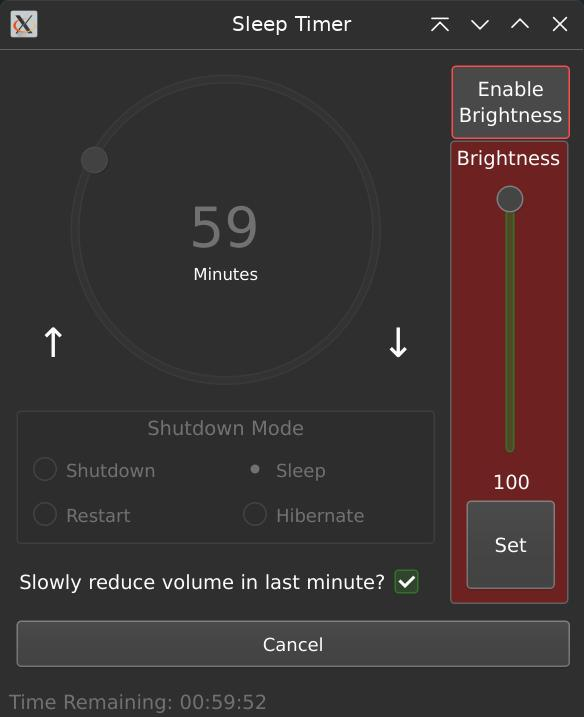

# SleepTimer

A simple python (and QT) app to sleep, hibernate, reboot or shutdown a system after a set period of time.

I made this to compliment a refurbished Surface Pro (hence simple UI) that I had recently purchased. All of the apps I found either didn't work, weren't optimized for touch, or ran on Electron. (Granted, the libraries for this will be quite large also, but I use Python anyway.)

Should work on Windows and Linux. 

## Features

- Set a timer between 1-180 minutes
- When the time is up, the application will pause playing media
- You can select Restart, Shutdown, Sleep or Hibernate.
- `[Optional]` Audio volume to reduces over the last minute
- `[Optional]` Change the brightness of the screen

> **Note**  
> *Brightness setting will only work on Windows and Xorg on Linux. It's also possble to turn the backlight off using this setting, so I added a button to enable it to be safe. You have been warned.*

## Requirements

### Windows

Install Python: [https://www.python.org/downloads/windows/](https://www.python.org/downloads/windows/)

```bash
pip install PyQt5 screen_brightness_control keyboard
```

### Linux

Ensure Python is intalled via your package manager

Install xdotool from your distributions package manager

```shell
pip install PyQt5 screen_brightness_control
```

## Useage
```shell
python main.py [--lodpi]
```

## HiDPI

The script will use HiDPI by default. If you wish to use the standard setting, pass --lodpi as an argument.

## TODO

- [x] Pause playing audio when going to sleep
- [x] Slowly adjust volume down (maybe in the last minute or two?)
- [x] Possibly add brightness control
- [x] Make the dial and spinbox react to the time decreasing.
- [x] Make the UI more uniform on both platforms.
- [x] Okay I need to fix the UI on windows, it's pretty awful ~~(see screenshot)~~

## Screenshot

 
